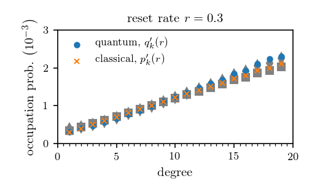
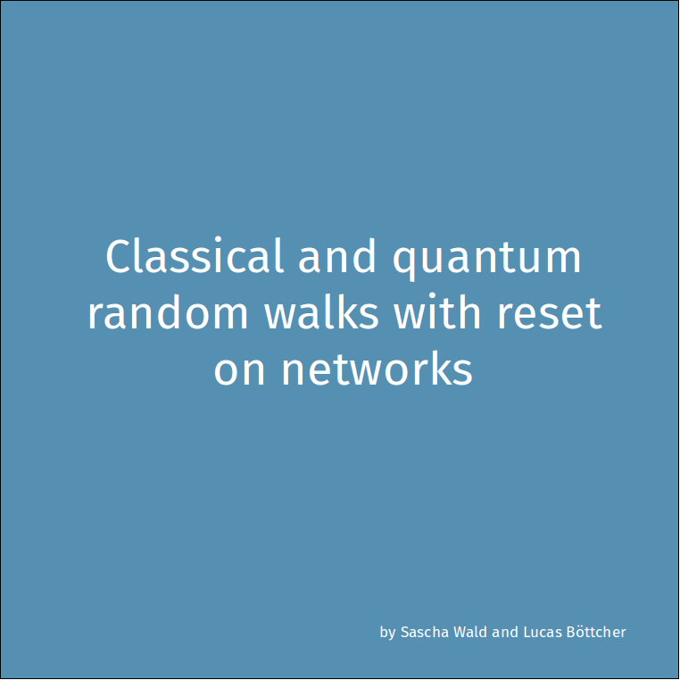

# q2c-walks

Simulation frameworks for classical, quantum, and hybrid classical-quantum walks on arbitrary networks.

The ``walkerlib'' directory contains definitions of classical and quantum Hamiltonians, analytical solutions of the occupation probability distributions, and numerical integration routines to simulate the evolution of classical, quantum, and hybrid classical-quantum walkers on arbitrary networks.

You can run the examples ``qc_walks.py`` and ``qsw_walks.py``. After running ``qc_walks.py``, you should be able to obtain the following plot: 

  

Orange crosses and blue disks are classical and quantum occupation probabilities, respectively. The grey markers denote corresponding analytical results.

You can also compare walker dynamics for various reset rates and networks. Here is a video that summarizes some properties of classical and quantum walks:

  

